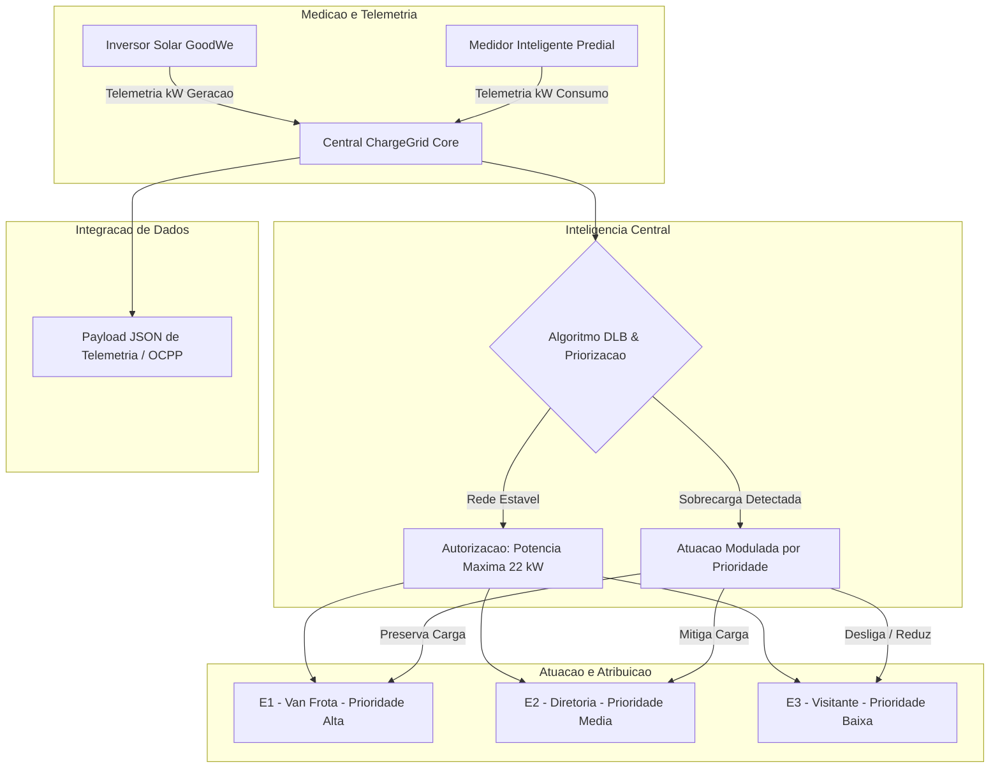

# ChargeGrid Intelligence - Dynamic Load Balancing (DLB)
> FIAP - Challenge GoodWe 2026 | Sprint 3: Prototipagem Funcional e Integracao

---

## Equipe Envolvida
* Pedro Andreassa - RM: 569318
* Pedro Yoshikado Garcia - RM: 570449
* Rafael Ferreirinha - RM: 571949
* Thiago Maluf - RM: 569852

---

## 1. Visao Geral do Projeto
O ChargeGrid Intelligence e uma solucao de automacao e gestao inteligente de demanda energetica desenvolvida para acelerar a transicao para a mobilidade eletrica comercial.

Na Sprint 3, a solucao evoluiu de uma prova de conceito em terminal para um prototipo funcional e integrado acoplado a um dashboard interativo em Streamlit. O sistema realiza a simulacao do ciclo operacional de 24 horas de um edificio comercial, gerenciando em tempo real o equilibrio entre a geracao fotovoltaica (ecossistema GoodWe), o consumo predial e a alocacao de potencia de estacoes de recarga veicular (EV).

---

## 2. Esquema Detalhado de Integracao dos Componentes

O fluxo de dados integra a medicao IoT de campo, a central de tomada de decisao algoritmica e o envio de comandos de limitacao de carga para as estacoes de recarga:



---

## 3. Justificativa Tecnica das Escolhas
- Python + Streamlit: Proporcionam uma plataforma leve, de rapida prototipagem e alta capacidade para processar pipelines de dados e simulacoes iterativas em tempo real.

- Algoritmo de Priorizacao Dinamica (DLB): Garante a protecao da infraestrutura fisica do imovel. Evita a ultrapassagem da demanda contratada junto a concessionaria de energia (impedindo multas astronómicas) e elimina a necessidade de investimentos financeiros imediatos no upgrade de subestacoes fisicas.

- Padrao de Telemetria em JSON: Garante interoperabilidade nativa com gateways IoT, protocolos de recarga (como OCPP) e plataformas de nuvem corporativas.

---

## 4. Resultados e Dados Funcionais Apresentados
- O prototipo simula a dinamica diurna e noturna do edificio:

- Fora do Horario de Pico (Diurno - 06h as 17h): A geracao solar GoodWe abate o consumo predial. O saldo de potencia na rede permite que todas as estacoes (E1, E2 e E3) operem na sua capacidade maxima de 22.0 kW.

- Horario de Pico (18h as 21h): Com a interrupcao da geracao solar e o aumento do consumo do edificio, a demanda liquida excede o limite estipulado. O sistema detecta a sobrecarga instantaneamente e aplica o corte progressivo na ordem Baixa Prioridade (Visitante) -> Media Prioridade (Diretoria) -> Alta Prioridade (Frota).

- Periodo Noturno (22h as 05h): O consumo predial reduz drasticamente, liberando a recarga noturna continua para a frota de veiculos comerciais.

---

5. Conexao com os Conteudos da Disciplina
- Pensamento Computacional: Decomposicao do sistema de distribuicao eletrica, abstracao de parametros operacionais e criacao do algoritmo defensivo de corte de carga.

- Programacao Aplicada: Construcao da aplicacao web funcional, gestao de estados (session_state), renderizacao de graficos dinamicos com Altair e manipulacao de DataFrames.

- Sistemas IoT e Automacao: Mapeamento da telemetria de entrada/saida atraves de barramentos de dados estruturados em JSON.

---

## Como Executar o Prototipo Funcional
Pre-requisitos
Certifique-se de ter o Python instalado no seu ambiente.

1. Clonar o Repositorio
```bash
    git clone [[https://github.com/SEU-USUARIO/Fiap-GoodWe-Chargegrid-Sprint2.git](https://github.com/SEU-USUARIO/Fiap-GoodWe-Chargegrid-Sprint2.git)](https://github.com/pedroyoshikadogarcia/Fiap-GoodWe-             Chargegrid-Sprint1-2-3-Grupo-03.git)
    cd Fiap-GoodWe-Chargegrid-Sprint1-2-3-Grupo-03
```
2. Instalar as Dependências
```bash
    pip install streamlit pandas altair
```
3. Executar o Dashboard
```bash
    python -m streamlit run app_chargegrid_sprint3.py
```
O servidor local sera iniciado e a interface abrira automaticamente no seu navegador padrao.
